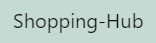

<div align="center">
  <a href="https://github.com/othneildrew/Best-README-Template">
    
  </a>
    <h3 align="center">Welcome To Shopping Hub</h3>
</div>

<!-- ABOUT THE PROJECT -->
## About The Project

 </img>

- [Click Here to watch the full video](https://youtu.be/inn7iNcB7U4) - *Youtube*

#### Description
Food Hub is an innovative project that leverages cutting-edge machine learning, deep learning and transformer techniques to provide a comprehensive food-related experience to users. 

**The system combines the power of:-**
- CNN (Convolutional Neural Network) to identify food images
- Hyperparameter-Tuned BERT (Bidirectional Encoder Representations from Transformers) to generate recipes from given ingredients
- Random Forest to predict the Dish
- cosine similarity to show the related recommendations.


<!-- Built With -->
## Built With

#### Tech Stack
**Language:** Python, HTML, CSS

**Frameworks:** Django, Bootstrap

**Libraries:** Numpy, Pandas, Matplotlib, Seaborn, Sklearn, tensorflow, keras, transformer, stable diffusion, cv2


<!-- Installation -->
## Installation

1. Clone the repo
   ```sh
   git clone https://github.com/choudharyprince890/Shopping-Hub
   ```
2. Install packages
   ```sh
   pip install requirements.txt
   ```
3. Run project
   ```sh
   python manage.py runserver
   ```

<!-- Feedback -->
## Feedback

If you have any feedback, please reach out to me at. 
8360193315


